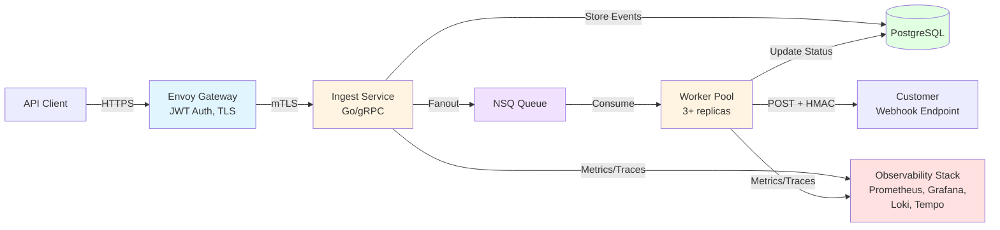

# Harborhook

> **A production-grade webhook delivery platform built to demonstrate platform engineering, distributed systems design, and SRE practices.**

Harborhook is a multi-tenant, reliable webhook delivery system built with Go. This is a **portfolio/resume project** designed to showcase modern platform engineering practices, operational maturity, and full-stack observability.

**Status**: ⚠️ This is a demonstration project, not production-ready software. Built for learning and showcasing technical skills.

[](https://github.com/austindbirch/harbor_hook/actions/workflows/ci.yaml)

[](https://goreportcard.com/report/github.com/austindbirch/harbor_hook)

---

## What This Project Demonstrates

### **Platform Engineering**
- Multi-tenant SaaS architecture with tenant isolation
- Reliable at-least-once delivery with configurable retry policies
- Dead Letter Queue (DLQ) handling and replay capabilities
- Horizontal scaling patterns for stateless services
- gRPC with HTTP/JSON gateway for API flexibility

### **Security & Authentication**
- JWT authentication (RS256) with JWKS key rotation
- mTLS for internal service communication
- HMAC-SHA256 webhook signatures for payload verification
- TLS certificate management and rotation procedures

### **Observability & SRE**
- Full observability stack deployed via Helm: Prometheus, Grafana, Tempo, Alertmanager (+ Loki in Docker Compose)
- Distributed tracing with OpenTelemetry (OTLP endpoints)
- SLO-based alerting with pre-configured Prometheus alert rules
- Comprehensive operational runbooks for incident response
- Performance metrics: throughput, latency percentiles, error rates, backlog depth, DLQ growth
- Grafana datasources pre-configured for unified metrics, logs, and traces

### **DevOps & Infrastructure**
- Kubernetes deployment with Helm charts including full observability stack
- GitHub Actions CI/CD pipeline with automated E2E tests
- Docker Compose for local development with complete observability
- Infrastructure as Code (Helm charts, Kubernetes manifests, ConfigMaps)
- Certificate and key rotation automation
- Multi-platform Docker images (amd64, arm64) for Apple Silicon support

### **Documentation & Operations**
- Detailed architecture documentation with Mermaid diagrams
- Production-ready operational runbooks (DLQ, backlog, latency, security)
- Comprehensive quickstart guide
- Security best practices and code examples

---

## TODO
- [x] Add MIT license
- [x] Remove .editorconfig
- [x] Remove helm dependncies from repo, but keep in builds
- [x] Commit protogen (remove code gen from CICD, and add a makefile entry for codegen)
- [ ] Setup cicd so it also builds on branches, so that tests and basic validations run without pushes to main
- [ ] Move JWT validation out of Envoy
- [ ] Generate a docs site and host on Github pages (check out [hugo](https://gohugo.io/))
- [ ] Write a frontend (support multiple users, configurability, start with a demo account for quickstart)

---

## Architecture Overview



**Flow**: Client → Envoy (auth) → Ingest (fanout) → NSQ → Workers → Customer Endpoints

**Key Features**:
- JWT-based multi-tenant authentication
- Event fanout to subscribed endpoints
- Exponential backoff retry with jitter
- DLQ for exhausted deliveries
- Real-time delivery status tracking

**[Full Architecture Documentation →](docs/architecture.md)**

---

## Quick Start

**Choose your path**:

### Kubernetes (Recommended) - 3 minutes
Uses pre-built images from GitHub Container Registry.

```bash
# Create local cluster
kind create cluster --name harborhook-demo

# Clone and install
git clone https://github.com/austindbirch/harbor_hook.git
cd harbor_hook

# Generate TLS certificates
cd deploy/docker/envoy/certs && ./generate_certs.sh && cd ../../../..
kubectl create secret generic harborhook-certs \
  --from-file=ca.crt=./deploy/docker/envoy/certs/ca.crt \
  --from-file=server.crt=./deploy/docker/envoy/certs/server.crt \
  --from-file=server.key=./deploy/docker/envoy/certs/server.key \
  --from-file=client.crt=./deploy/docker/envoy/certs/client.crt \
  --from-file=client.key=./deploy/docker/envoy/certs/client.key

# Install with Helm
helm dependency update ./charts/harborhook
helm install harborhook ./charts/harborhook
kubectl wait --for=condition=Available --timeout=3m deployment --all

# Send your first webhook!
kubectl port-forward svc/harborhook-envoy 8443:8443 &
kubectl port-forward svc/harborhook-jwks-server 8082:8082 &

TOKEN=$(curl -s -X POST "http://localhost:8082/token" \
  -H "Content-Type: application/json" \
  -d '{"tenant_id":"tn_demo"}' | jq -r '.token')

curl -sk "https://localhost:8443/v1/ping" -H "Authorization: Bearer $TOKEN"
```

### Docker Compose (For Contributors) - 10 minutes
Build from source for local development.

```bash
git clone https://github.com/austindbirch/harbor_hook.git
cd harbor_hook

# Build from source
make proto
make build

# Start all services
make up

# Verify
curl http://localhost:8080/healthz
open http://localhost:4171  # NSQ Admin
```

📖 **[Complete Quickstart Guide →](docs/QUICKSTART.md)**

---

## Core Components

### Services

| Component | Purpose | Technology |
|-----------|---------|------------|
| **Ingest** | Event ingestion API, fanout logic | Go, gRPC, grpc-gateway |
| **Worker** | Webhook delivery with retry/backoff | Go, NSQ consumer |
| **JWKS Server** | JWT token issuer, key rotation | Go, RS256 signing |
| **Envoy** | API gateway, JWT auth, mTLS | Envoy Proxy |
| **NSQ** | Message queue for delivery tasks | NSQ (nsqd, nsqlookupd) |
| **PostgreSQL** | Events, deliveries, DLQ storage | PostgreSQL 16+ |

### Tooling

| Tool | Purpose |
|------|---------|
| **harborctl** | CLI for managing endpoints, subscriptions, events |
| **Fake Receiver** | Test webhook endpoint with signature verification |
| **Data Seeding** | Scripts to populate realistic demo data (KinD/Docker Compose) |
| **E2E Tests** | Automated integration tests for CI/CD |

### Observability

**Available in both Docker Compose and Kubernetes deployments:**

| Component | Purpose | Port | Status |
|-----------|---------|------|--------|
| **Prometheus** | Metrics collection and querying | 9090 | ✅ Enabled by default |
| **Grafana** | Unified dashboards (metrics, logs, traces) | 3000 | ✅ Enabled by default |
| **Tempo** | Distributed tracing (OTLP) | 3200, 4317, 4318 | ✅ Enabled by default |
| **Alertmanager** | Alert routing and deduplication | 9093 | ✅ Enabled by default |
| **Loki** | Log aggregation | 3100 | ⚠️ Docker Compose only* |
| **Promtail** | Log shipping | - | ⚠️ Docker Compose only* |

*Loki/Promtail disabled in Kubernetes by default (requires object storage). Can be enabled in `values.yaml`.

---

## Key Features

### Reliable Delivery
- **At-least-once delivery** guarantee
- **Exponential backoff** with jitter: `1s, 5s, 10s, 30s, 1m`
- **Max retry attempts**: Configurable (default: 5)
- **Dead Letter Queue**: Failed deliveries moved to DLQ after exhaustion
- **Replay capability**: Operators can replay DLQ entries

### Security
- **JWT authentication**: RS256 with JWKS key rotation
- **Webhook signatures**: HMAC-SHA256 for payload verification
- **mTLS**: Internal service-to-service encryption
- **Multi-tenant isolation**: Tenant ID enforcement at API and data layers

### Observability
- **Full observability stack**: Prometheus, Grafana, Tempo, Alertmanager (+ Loki/Promtail in Docker Compose)
- **Distributed tracing**: End-to-end request flow visualization with OpenTelemetry
- **Metrics**: Throughput, latency (p50/p95/p99), error rates, backlog depth, DLQ growth
- **Structured logs**: JSON logs with trace correlation (via `trace_id`)
- **Dashboards**: Pre-configured Grafana datasources for unified observability
- **SLO-based alerting**: Pre-configured Prometheus alert rules for burn rate, latency, backlog, DLQ

### Operations
- **Horizontal scaling**: Stateless services scale independently
- **Health checks**: Liveness and readiness probes
- **Graceful shutdown**: Clean connection draining
- **Operational runbooks**: Production-ready incident response procedures

### Testing
- **Unit tests**: Core business logic coverage
- **E2E tests**: Full workflow validation in CI
- **Signature verification tests**: Security validation
- **Data seeding**: Realistic demo data for testing and benchmarking
- **Load testing**: Performance benchmarking with configurable scales (small/medium/large)

---

## Tech Stack

**Languages & Frameworks**:
- Go 1.24+ (services, CLI)
- Protocol Buffers (API contracts)
- Bash (scripting, automation)

**Infrastructure**:
- Kubernetes (production deployment)
- Helm (package management)
- Docker Compose (local development)
- KinD (local Kubernetes)

**Data & Messaging**:
- PostgreSQL 16+ (persistent storage)
- NSQ (message queue)

**API & Gateway**:
- gRPC (internal APIs)
- grpc-gateway (HTTP/JSON transcoding)
- Envoy Proxy (API gateway)

**Observability**:
- Prometheus (metrics)
- Grafana (visualization)
- Loki (logs)
- Tempo (traces)
- Promtail (log shipping)
- Alertmanager (alerting)

**Security**:
- JWT (RS256) + JWKS
- TLS 1.2+ & mTLS
- HMAC-SHA256 (webhook signatures)

**CI/CD**:
- GitHub Actions (build, test, publish)
- Docker (containerization)
- GitHub Container Registry (image hosting)

---

## Documentation

### Getting Started
- [**Quickstart Guide**](docs/QUICKSTART.md) - Get running in <10 minutes
- [**Architecture Documentation**](docs/architecture.md) - System design and components
- [**Signature Verification**](docs/signature-verification.md) - Webhook security implementation

### Operations
- [**Operational Runbooks**](docs/runbooks/README.md) - Incident response procedures
  - [DLQ Spike](docs/runbooks/dlq-spike.md) - Handle failed deliveries
  - [Backlog Growth](docs/runbooks/backlog-growth.md) - Scale workers, manage queue
  - [High Latency](docs/runbooks/high-latency.md) - Debug slow deliveries
  - [JWT Rotation](docs/runbooks/jwt-rotation.md) - Rotate authentication keys
  - [Certificate Rotation](docs/runbooks/cert-rotation.md) - Rotate TLS certificates

### Reference
- [**Harborctl CLI Guide**](docs/harborctl.md) - Command-line interface usage
- [**Project Implementation Plan**](docs/implementation_plan.md) - Development phases
- [**Technical Notes**](docs/tech_notes.md) - Design decisions and rationale

---

## Project Structure

```
harbor_hook/
├── cmd/                      # Service entrypoints
│   ├── ingest/               # Event ingestion service
│   ├── worker/               # Webhook delivery worker
│   ├── jwks-server/          # JWT token issuer
│   ├── fake-receiver/        # Test webhook endpoint
│   └── harborctl/            # CLI tool
├── proto/                    # Protocol Buffer definitions
├── deploy/
│   └── docker/               # Docker Compose setup
│       ├── envoy/            # Envoy gateway config
│       ├── postgres/         # Database init scripts
│       ├── grafana/          # Dashboards and datasources
│       └── prometheus/       # Metrics and alerts config
├── charts/harborhook/        # Helm chart for Kubernetes
├── scripts/                  # Operational scripts
│   ├── ci/                   # CI/CD scripts
│   ├── harborctl/            # CLI demo scripts
│   └── observability/        # Observability testing
├── docs/                     # Documentation
│   ├── architecture.md       # System architecture
│   ├── QUICKSTART.md         # Getting started guide
│   ├── signature-verification.md  # Webhook security
│   └── runbooks/             # Operational procedures
└── .github/workflows/        # CI/CD pipelines
```

---

## Development

### Prerequisites
- Go 1.24+
- Docker & Docker Compose
- `kubectl` (for Kubernetes)
- Helm 3.10+ (for Kubernetes)
- Protocol Buffers compiler (`protoc`)

### Building from Source

```bash
# Install proto tools
go install google.golang.org/protobuf/cmd/protoc-gen-go@latest
go install google.golang.org/grpc/cmd/protoc-gen-go-grpc@latest
go install github.com/grpc-ecosystem/grpc-gateway/v2/protoc-gen-grpc-gateway@latest

# Generate code from .proto files
make proto

# Build all services
make build

# Run tests
go test ./...

# Start with Docker Compose
make up

# View logs
make logs
```

### Making Changes

```bash
# Make changes to Go code
nano cmd/worker/main.go

# Rebuild
make build

# Restart service
docker-compose restart worker

# Run E2E tests
./scripts/observability/e2e_test.sh
```

---

## Monitoring & Observability

### Access UIs

**Kubernetes** (requires port-forwarding):
```bash
# Observability stack (enabled by default)
kubectl port-forward svc/harborhook-prometheus-server 9090:80  # Prometheus
kubectl port-forward svc/harborhook-grafana 3000:80            # Grafana
kubectl port-forward svc/harborhook-alertmanager 9093:9093    # Alertmanager

# Get Grafana admin password
kubectl get secret harborhook-grafana -o jsonpath='{.data.admin-password}' | base64 -d

# NSQ Admin
kubectl port-forward svc/harborhook-nsq-nsqadmin 4171:4171

# Access URLs
open http://localhost:9090  # Prometheus
open http://localhost:3000  # Grafana (username: admin, password: from above)
open http://localhost:9093  # Alertmanager
open http://localhost:4171  # NSQ Admin
```

**Docker Compose** (direct access, no port-forwarding needed):
```bash
open http://localhost:9090  # Prometheus
open http://localhost:3000  # Grafana (admin/admin)
open http://localhost:9093  # Alertmanager
open http://localhost:3200  # Tempo
open http://localhost:3100  # Loki
open http://localhost:4171  # NSQ Admin
```

### Key Metrics

Query these in Prometheus (http://localhost:9090) or Grafana:

```promql
# Event publishing rate
rate(harborhook_events_published_total[5m])

# Delivery success rate
rate(harborhook_deliveries_total{status="delivered"}[5m])
  / rate(harborhook_deliveries_total[5m])

# P95 delivery latency
histogram_quantile(0.95, rate(harborhook_delivery_latency_seconds_bucket[5m]))

# Worker backlog depth
harborhook_nsq_topic_depth{topic="deliveries"}

# DLQ growth rate
rate(harborhook_dlq_messages_total[1h])

# Retry rate by reason
rate(harborhook_retries_total[5m]) by (reason)
```

**Comprehensive Setup**: See [Quickstart Guide - Step 8](docs/QUICKSTART.md#step-8-access-observability-stack-kubernetes-only) for full observability access instructions.

---

## CI/CD Pipeline

The project includes a full CI/CD pipeline in GitHub Actions:

1. **Build & Test**
   - Generate protobufs
   - Compile Go binaries
   - Run unit tests

2. **Build & Push Images**
   - Build Docker images for each service
   - Push to GitHub Container Registry (`ghcr.io`)
   - Tag with commit SHA

3. **E2E Testing**
   - Create KinD cluster
   - Deploy with Helm using published images (observability disabled for faster tests)
   - Run end-to-end tests
   - Validate full workflow

**View CI Status**: [GitHub Actions](https://github.com/austindbirch/harbor_hook/actions)

**Note**: The observability stack (Prometheus, Grafana, Tempo, Alertmanager) is disabled during CI E2E tests for performance, but enabled by default for manual Kubernetes deployments.

---

## What I Learned

This project helped me develop expertise in:

### Technical Skills
- **Distributed Systems**: Message queues, eventual consistency, at-least-once delivery
- **API Design**: gRPC with HTTP/JSON gateway, RESTful principles
- **Security**: JWT, mTLS, HMAC signatures, TLS certificate management
- **Observability**: Full-stack instrumentation, distributed tracing, SLO-based alerting
- **Go Programming**: Concurrency patterns, gRPC services, error handling
- **Infrastructure**: Kubernetes, Helm, Docker, service mesh concepts

### Operational Skills
- **SRE Practices**: Runbook creation, incident response procedures
- **Monitoring**: Prometheus queries, Grafana dashboards, alert rules
- **Performance**: Latency optimization, horizontal scaling, backpressure handling
- **DevOps**: CI/CD pipelines, automated testing, Infrastructure as Code

### Software Engineering
- **System Design**: Multi-tenancy, retry patterns, idempotency, DLQ strategies
- **Code Organization**: Clean architecture, separation of concerns
- **Testing**: Unit tests, integration tests, E2E tests
- **Documentation**: Technical writing, architecture diagrams, operational guides

---

## Limitations & Future Work

**Current Limitations** (intentional for portfolio scope):
- Single-region deployment only
- Basic rate limiting (not production-grade)
- No multi-cluster federation
- Limited horizontal scaling optimization
- Self-signed certificates (not production)

**Potential Enhancements**:
- [ ] Circuit breakers for failing endpoints
- [ ] Advanced retry policies (exponential, linear, fixed)
- [ ] Customer-facing webhook dashboard
- [ ] Webhook payload transformation/templating
- [ ] Multi-region deployment with geo-routing
- [ ] Advanced rate limiting with token bucket
- [ ] Built-in load testing framework

---

## License

This is a portfolio project for educational and demonstration purposes. Not licensed for commercial use.

---

## Acknowledgments

Built to demonstrate platform engineering and SRE practices for potential employers. Inspired by production webhook systems like Stripe, Twilio, and GitHub.

**Technologies Used**: Go, Kubernetes, NSQ, PostgreSQL, Prometheus, Grafana, Envoy, gRPC, OpenTelemetry

---

## Contact

**Austin Birch**
- GitHub: [@austindbirch](https://github.com/austindbirch)
- Project: [harborhook](https://github.com/austindbirch/harbor_hook)
