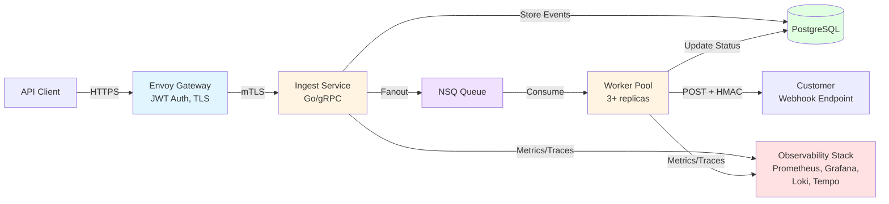

# Harborhook

> **A production-grade webhook delivery platform built to demonstrate platform engineering, distributed systems design, and SRE practices.**

Harborhook is a multi-tenant, reliable webhook delivery system built with Go. This is a **portfolio/resume project** designed to showcase modern platform engineering practices, operational maturity, and full-stack observability.

View on GitHub

---

## What This Project Demonstrates



### Platform Engineering
- Multi-tenant SaaS architecture with tenant isolation
- Reliable at-least-once delivery with configurable retry policies
- Dead Letter Queue (DLQ) handling and replay capabilities
- Horizontal scaling patterns for stateless services
- gRPC with HTTP/JSON gateway for API flexibility

<--->

### Security & Authentication
- JWT authentication (RS256) with JWKS key rotation
- mTLS for internal service communication
- HMAC-SHA256 webhook signatures for payload verification
- TLS certificate management and rotation procedures





### Observability & SRE
- Full observability stack: Prometheus, Grafana, Tempo, Alertmanager
- Distributed tracing with OpenTelemetry
- SLO-based alerting with pre-configured alert rules
- Comprehensive operational runbooks for incident response
- Performance metrics: throughput, latency percentiles, error rates

<--->

### DevOps & Infrastructure
- Kubernetes deployment with Helm charts
- GitHub Actions CI/CD pipeline with automated E2E tests
- Docker Compose for local development
- Infrastructure as Code (Helm charts, Kubernetes manifests)
- Multi-platform Docker images (amd64, arm64)



---

## Architecture Overview

**Flow**: Client → Envoy (auth) → Ingest (fanout) → NSQ → Workers → Customer Endpoints

**[Full Architecture Documentation →](/docs/architecture/)**

---

## Documentation

### Getting Started
- [**Quickstart Guide**](/docs/quickstart/) - Get running in <10 minutes
- [**Architecture**](/docs/architecture/) - System design and components

### Operations
- [**Runbooks**](/docs/runbooks/) - Incident response procedures
- [**CLI Guide**](/docs/harborctl/) - Command-line interface usage

### Reference
- [**Signature Verification**](/docs/signature_verification/) - Webhook security
- [**Glossary**](/docs/glossary/) - Terms and definitions