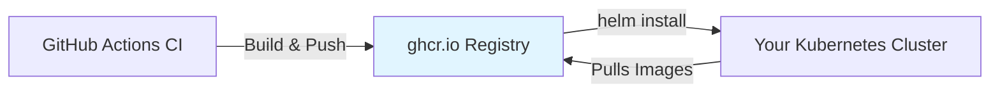
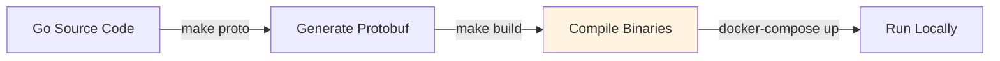

# Harborhook Quickstart Guide

This guide will help you get Harborhook running in under 10 minutes and deliver your first webhook.

## Understanding Deployment Options

This repository contains **both** local development code and published container images:

### **Published Images (Kubernetes)** - Recommended for Quick Start
- **What**: Pre-built Docker images published to GitHub Container Registry (ghcr.io)
- **When to use**: Quick demos, CI/CD testing, production deployments
- **How it works**: Helm charts pull images from `ghcr.io/austindbirch/harbor_hook/*`
- **Build required**: No - images are pre-built
- **Time to start**: ~3 minutes

### **Local Development (Docker Compose)** - For Contributors
- **What**: Source code that you build locally
- **When to use**: Contributing to Harborhook, testing local changes
- **How it works**: `make build` compiles Go code, `docker-compose up` runs locally-built images
- **Build required**: Yes - you compile from source
- **Time to start**: ~10 minutes (includes build time)

---

## Prerequisites

Choose your deployment path and ensure you have the required tools:

<table>
<tr>
<th>Kubernetes (Published Images)</th>
<th>Docker Compose (Local Build)</th>
</tr>
<tr>
<td>

- Docker Desktop or similar
- `kubectl` CLI
- Helm 3.10+
- 4GB RAM available

</td>
<td>

- Docker Desktop with Compose
- Go 1.24+
- `make`
- Protocol Buffers compiler (`protoc`)
- 4GB RAM available

</td>
</tr>
</table>

---

## Quick Start: Kubernetes (Published Images)

**Best for**: First-time users, demos, testing

This method uses **pre-built images** from GitHub Container Registry. No compilation needed!

### Step 1: Create Local Kubernetes Cluster

```bash
# Install KinD (Kubernetes in Docker) if not already installed
# macOS
brew install kind

# Linux
curl -Lo ./kind https://kind.sigs.k8s.io/dl/latest/kind-linux-amd64
chmod +x ./kind
sudo mv ./kind /usr/local/bin/kind

# Create cluster
kind create cluster --name harborhook-demo

# Verify
kubectl cluster-info --context kind-harborhook-demo
```

### Step 2: Generate TLS Certificates

```bash
# Clone the repository (needed for cert generation)
git clone https://github.com/austindbirch/harbor_hook.git
cd harbor_hook

# Generate certificates for Envoy gateway
cd deploy/docker/envoy/certs
./generate_certs.sh
cd ../../../..

# Create Kubernetes secret with certificates
kubectl create secret generic harborhook-certs \
  --from-file=ca.crt=./deploy/docker/envoy/certs/ca.crt \
  --from-file=server.crt=./deploy/docker/envoy/certs/server.crt \
  --from-file=server.key=./deploy/docker/envoy/certs/server.key \
  --from-file=client.crt=./deploy/docker/envoy/certs/client.crt \
  --from-file=client.key=./deploy/docker/envoy/certs/client.key
```

### Step 3: Install with Helm

```bash
# Update Helm dependencies (PostgreSQL, NSQ charts)
helm dependency update ./charts/harborhook

# Install Harborhook
# Note: This pulls PRE-BUILT images from ghcr.io (no local build required)
helm install harborhook ./charts/harborhook \
  --set ingest.image.tag=latest \
  --set worker.image.tag=latest \
  --set jwksServer.image.tag=latest \
  --set fakeReceiver.image.tag=latest \
  --set nsqMonitor.image.tag=latest

# Wait for all pods to be ready (2-3 minutes)
kubectl wait --for=condition=Available --timeout=3m deployment --all

# Wait for PostgreSQL to initialize
kubectl wait --for=jsonpath='{.status.readyReplicas}'=1 --timeout=2m statefulset/harborhook-postgres
sleep 10  # Extra time for database initialization scripts

# Verify all pods are running
kubectl get pods
```

**Expected output:**
```
NAME                                          READY   STATUS    RESTARTS   AGE
harborhook-ingest-xxxxxxxxxx-xxxxx           1/1     Running   0          2m
harborhook-worker-xxxxxxxxxx-xxxxx           1/1     Running   0          2m
harborhook-jwks-server-xxxxxxxxxx-xxxxx      1/1     Running   0          2m
harborhook-fake-receiver-xxxxxxxxxx-xxxxx    1/1     Running   0          2m
harborhook-envoy-xxxxxxxxxx-xxxxx            1/1     Running   0          2m
harborhook-postgres-0                         1/1     Running   0          2m
harborhook-nsq-nsqd-0                        1/1     Running   0          2m
harborhook-nsq-nsqlookupd-xxxxxxxxxx-xxxxx   1/1     Running   0          2m
harborhook-nsq-nsqadmin-xxxxxxxxxx-xxxxx     1/1     Running   0          2m
```

### Step 4: Set Up Port Forwarding

Open multiple terminal windows for port forwarding:

```bash
# Terminal 1: Envoy Gateway (API access)
kubectl port-forward svc/harborhook-envoy 8443:8443

# Terminal 2: JWKS Server (JWT tokens)
kubectl port-forward svc/harborhook-jwks-server 8082:8082

# Terminal 3 (optional): NSQ Admin UI
kubectl port-forward svc/harborhook-nsq-nsqadmin 4171:4171
# Then open: http://localhost:4171
```

### Step 5: Send Your First Webhook

```bash
# Get a JWT token for authentication
TOKEN=$(curl -s -X POST "http://localhost:8082/token" \
  -H "Content-Type: application/json" \
  -d '{"tenant_id":"tn_demo"}' | jq -r '.token')

echo "Token: $TOKEN"

# Test connectivity
curl -sk -X GET "https://localhost:8443/v1/ping" \
  -H "Authorization: Bearer $TOKEN"
# Expected: {"message":"pong"}

# Create a webhook endpoint
ENDPOINT_RESP=$(curl -sk -X POST "https://localhost:8443/v1/tenants/tn_demo/endpoints" \
  -H "Authorization: Bearer $TOKEN" \
  -H "Content-Type: application/json" \
  -d '{
    "tenant_id": "tn_demo",
    "url": "http://harborhook-fake-receiver:8081/hook",
    "secret": "demo_secret"
  }')

ENDPOINT_ID=$(echo "$ENDPOINT_RESP" | jq -r '.endpoint.id')
echo "Created endpoint: $ENDPOINT_ID"

# Create a subscription
SUB_RESP=$(curl -sk -X POST "https://localhost:8443/v1/tenants/tn_demo/subscriptions" \
  -H "Authorization: Bearer $TOKEN" \
  -H "Content-Type: application/json" \
  -d "{
    \"tenant_id\": \"tn_demo\",
    \"event_type\": \"user.signup\",
    \"endpoint_id\": \"$ENDPOINT_ID\"
  }")

SUB_ID=$(echo "$SUB_RESP" | jq -r '.subscription.id')
echo "Created subscription: $SUB_ID"

# Publish an event (this triggers the webhook!)
EVENT_RESP=$(curl -sk -X POST "https://localhost:8443/v1/tenants/tn_demo/events:publish" \
  -H "Authorization: Bearer $TOKEN" \
  -H "Content-Type: application/json" \
  -d "{
    \"tenant_id\": \"tn_demo\",
    \"event_type\": \"user.signup\",
    \"payload\": {
      \"user_id\": \"user_12345\",
      \"email\": \"alice@example.com\",
      \"signed_up_at\": \"$(date -u +%Y-%m-%dT%H:%M:%SZ)\"
    },
    \"idempotency_key\": \"signup_$(date +%s)\"
  }")

EVENT_ID=$(echo "$EVENT_RESP" | jq -r '.eventId')
FANOUT=$(echo "$EVENT_RESP" | jq -r '.fanoutCount')

echo "✅ Event published!"
echo "   Event ID: $EVENT_ID"
echo "   Fanout: $FANOUT endpoint(s)"

# Wait for delivery
echo "Waiting 5 seconds for webhook delivery..."
sleep 5

# Check delivery status
curl -sk -X GET "https://localhost:8443/v1/events/$EVENT_ID/deliveries" \
  -H "Authorization: Bearer $TOKEN" | jq

# Expected output shows delivered status
```

### Step 6: Verify the Webhook Was Delivered

```bash
# Check fake-receiver logs
kubectl logs -l app.kubernetes.io/component=fake-receiver --tail=20

# You should see log entries like:
# {"level":"info","msg":"Received webhook","signature":"sha256=...","timestamp":"..."}
# {"level":"info","msg":"Signature verified successfully"}
```

🎉 **Congratulations!** You've successfully published an event and delivered a webhook using Harborhook!

---

## Local Development: Docker Compose (Build from Source)

**Best for**: Contributors, developers making code changes

This method **builds from source code** - you'll compile the Go binaries locally.

### Step 1: Clone and Setup

```bash
# Clone repository
git clone https://github.com/austindbirch/harbor_hook.git
cd harbor_hook

# Install required Go tools for protobuf generation
go install google.golang.org/protobuf/cmd/protoc-gen-go@latest
go install google.golang.org/grpc/cmd/protoc-gen-go-grpc@latest
go install github.com/grpc-ecosystem/grpc-gateway/v2/protoc-gen-grpc-gateway@latest
go install github.com/google/gnostic/cmd/protoc-gen-openapi@latest
```

### Step 2: Generate Protocol Buffers

```bash
# Generate Go code from .proto files
make proto

# Verify protogen directory was created
ls -la protogen/
```

### Step 3: Build Go Binaries

```bash
# Build all services from source (ingest, worker, jwks-server, etc.)
make build

# This compiles Go code and creates binaries in ./bin/
ls -la bin/
# You should see: ingest, worker, jwks-server, fake-receiver, harborctl
```

**Note**: This step is what differentiates local development from using published images. You're building the actual binaries from the Go source code in this repository.

### Step 4: Start Services

```bash
# Start all services with Docker Compose
# This uses the binaries you just built (NOT published images)
make up

# Wait for services to initialize (~30 seconds)
sleep 30

# Check logs
make logs
```

### Step 5: Verify Services

```bash
# Check service health
curl -s http://localhost:8080/healthz | jq  # Ingest
curl -s http://localhost:8082/healthz | jq  # JWKS Server
curl -s http://localhost:8081/healthz | jq  # Fake Receiver

# Open NSQ Admin UI
open http://localhost:4171

# All health checks should return 200 OK
```

### Step 6: Send Your First Webhook

```bash
# Install harborctl CLI (optional but recommended)
make install-cli  # Requires sudo

# Or use it directly from bin/
./bin/harborctl --help

# Get JWT token
TOKEN=$(curl -s -X POST "http://localhost:8082/token" \
  -H "Content-Type: application/json" \
  -d '{"tenant_id":"tn_demo"}' | jq -r '.token')

# Test connectivity through Envoy gateway
curl -sk -X GET "https://localhost:8443/v1/ping" \
  -H "Authorization: Bearer $TOKEN"

# Create endpoint, subscription, and publish event
# (Same commands as Kubernetes quick start above)
```

### Step 7: Making Changes

```bash
# Make changes to Go code
vim cmd/worker/main.go

# Rebuild
make build

# Restart services
docker-compose restart worker

# Test your changes
```

---

## Verifying Your Installation

Regardless of which method you chose, run these checks:

### Health Check: All Services

```bash
# If using Kubernetes:
kubectl get pods

# If using Docker Compose:
docker-compose ps

# All services should show Running/Healthy status
```

### Health Check: Database

```bash
# Kubernetes:
kubectl exec harborhook-postgres-0 -- env PGPASSWORD=postgres psql -U postgres -d harborhook -c "SELECT COUNT(*) FROM harborhook.tenants;"

# Docker Compose:
docker exec hh-postgres psql -U postgres -d harborhook -c "SELECT COUNT(*) FROM harborhook.tenants;"

# Expected output: count = 1 (the demo tenant)
```

### Health Check: NSQ Queue

```bash
# Open NSQ Admin UI
# Kubernetes: http://localhost:4171 (after port-forward)
# Docker Compose: http://localhost:4171

# You should see:
# - Topic "deliveries" exists
# - Channel "workers" exists
# - Depth should be 0 (no pending messages)
```

### Health Check: Observability (Docker Compose Only)

```bash
# Prometheus
open http://localhost:9090
# Query: up
# All services should show value=1

# Grafana
open http://localhost:3000
# Login: admin/admin
# Navigate to Dashboards → Harborhook
```

---

## Understanding the Difference: Images vs Source

### Published Images Path (Kubernetes)



**What happens:**
1. GitHub Actions builds images on every push to `main`
2. Images are tagged and pushed to GitHub Container Registry
3. Helm charts reference these images: `ghcr.io/austindbirch/harbor_hook/ingest:latest`
4. When you run `helm install`, Kubernetes pulls the pre-built images
5. **No local compilation needed!**

### Local Development Path (Docker Compose)



**What happens:**
1. You run `make proto` to generate code from `.proto` files
2. You run `make build` to compile Go source into binaries
3. Docker Compose mounts these binaries into containers
4. Services run using **your locally-built code**
5. **You can modify and test changes immediately!**

### When to Use Which?

| Scenario | Use Kubernetes | Use Docker Compose |
|----------|----------------|-------------------|
| First time trying Harborhook | ✅ | |
| Quick demo or testing | ✅ | |
| CI/CD pipeline | ✅ | |
| Contributing code changes | | ✅ |
| Testing local modifications | | ✅ |
| Debugging issues | | ✅ |
| Production deployment | ✅ | |

---

## Next Steps

Now that you have Harborhook running:

### 1. Explore the Architecture
- Read [Architecture Documentation](./architecture.md)
- View the system diagram and component details
- Understand the request flow

### 2. Learn About Security
- [Webhook Signature Verification](./signature-verification.md)
- How to verify HMAC signatures in your webhook receivers
- Code examples in multiple languages

### 3. Use the CLI
- Read [Harborctl Guide](./harborctl.md)
- Manage endpoints, subscriptions, and deliveries
- Replay failed webhooks from DLQ

### 4. Monitor Your System
- **Kubernetes**: Deploy observability stack separately
- **Docker Compose**: Already included!
  - Grafana: http://localhost:3000 (admin/admin)
  - Prometheus: http://localhost:9090
  - NSQ Admin: http://localhost:4171

### 5. Run End-to-End Tests
```bash
# Kubernetes
./scripts/ci/e2e_test.sh

# Docker Compose
./scripts/observability/e2e_test.sh
```

### 6. Read Operational Runbooks
- [DLQ Spike](./runbooks/dlq-spike.md) - Handle failed deliveries
- [Backlog Growth](./runbooks/backlog-growth.md) - Scale workers
- [High Latency](./runbooks/high-latency.md) - Debug slow deliveries
- [JWT Rotation](./runbooks/jwt-rotation.md) - Rotate auth keys
- [Cert Rotation](./runbooks/cert-rotation.md) - Rotate TLS certificates

---

## Troubleshooting

### Issue: Pods stuck in Pending (Kubernetes)

```bash
# Check pod status
kubectl describe pod <pod-name>

# Common causes:
# - Insufficient cluster resources
# - Image pull issues (check image exists in ghcr.io)

# Solution: Ensure KinD cluster has enough resources
kind delete cluster --name harborhook-demo
kind create cluster --name harborhook-demo --config kind-config.yaml
```

### Issue: Build fails (Docker Compose)

```bash
# Ensure Go version is 1.24+
go version

# Ensure proto tools are installed
which protoc-gen-go protoc-gen-go-grpc

# Clean and rebuild
make clean
make proto
make build
```

### Issue: Database connection errors

```bash
# Kubernetes: Check PostgreSQL is ready
kubectl logs harborhook-postgres-0

# Docker Compose: Check PostgreSQL is running
docker logs hh-postgres

# Ensure init scripts ran successfully
# Look for "database system is ready to accept connections"
```

### Issue: JWT authentication fails

```bash
# Verify JWKS server is accessible
curl http://localhost:8082/.well-known/jwks.json

# Should return JSON with public keys

# Get a fresh token
TOKEN=$(curl -s -X POST "http://localhost:8082/token" \
  -H "Content-Type: application/json" \
  -d '{"tenant_id":"tn_demo"}' | jq -r '.token')

# Decode token to verify claims
echo $TOKEN | cut -d. -f2 | base64 -d 2>/dev/null | jq
```

### Issue: Webhook not delivered

```bash
# Check worker logs
kubectl logs -l app.kubernetes.io/component=worker --tail=100
# or
docker logs hh-worker

# Check NSQ queue depth
curl http://localhost:4171/api/topics/deliveries | jq .depth

# Check delivery status in database
kubectl exec harborhook-postgres-0 -- env PGPASSWORD=postgres psql -U postgres -d harborhook -c \
  "SELECT id, status, attempt, last_error FROM harborhook.deliveries ORDER BY created_at DESC LIMIT 10;"
```

---

## Cleanup

### Kubernetes

```bash
# Uninstall Helm release
helm uninstall harborhook

# Delete cluster
kind delete cluster --name harborhook-demo

# Remove cloned repository (if desired)
cd ..
rm -rf harbor_hook
```

### Docker Compose

```bash
# Stop and remove containers
make down

# Remove built binaries
make clean

# Remove cloned repository (if desired)
cd ..
rm -rf harbor_hook
```

---

## Getting Help

- **Documentation**: [docs/](./README.md)
- **Issues**: [GitHub Issues](https://github.com/austindbirch/harbor_hook/issues)
- **Architecture**: [architecture.md](./architecture.md)
- **Runbooks**: [runbooks/](./runbooks/README.md)

---

**Ready to dive deeper?** Check out the [Architecture Guide](./architecture.md) to understand how Harborhook works under the hood!
