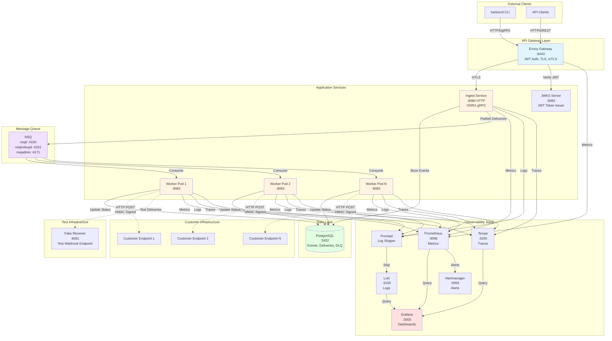
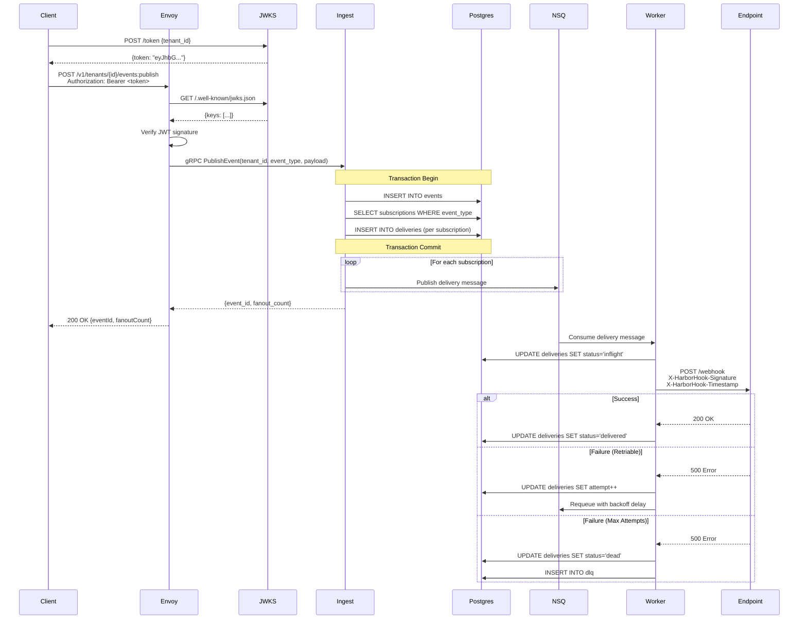

# Harborhook Architecture

## Overview

Harborhook is a multi-tenant, reliable webhook delivery platform built with Go, designed for high availability, observability, and operational excellence. The system guarantees at-least-once delivery with configurable retry policies, HMAC signature verification, and comprehensive distributed tracing.

## System Architecture



## Request Flow: Publishing an Event



## Component Details

### API Gateway: Envoy

**Purpose**: Secure API gateway providing authentication, TLS termination, and request routing

**Responsibilities**:
- JWT token verification (RS256) via JWKS
- TLS termination for external traffic (port 8443)
- mTLS for internal service communication
- HTTP/gRPC transcoding (grpc-gateway)
- Rate limiting and request validation

**Configuration**:
- External: HTTPS on port 8443
- Internal: gRPC over mTLS
- JWT public keys fetched from JWKS server

### Ingest Service

**Purpose**: Event ingestion API for publishing webhook events

**Responsibilities**:
- Validate event payloads and tenant authorization
- Store events in PostgreSQL
- Fan out to subscribed endpoints (query subscriptions)
- Publish delivery tasks to NSQ
- Idempotency via `(tenant_id, idempotency_key)` constraint

**API Endpoints**:
- `POST /v1/tenants/{tenant_id}/events:publish` - Publish event
- `GET /v1/ping` - Health check
- `POST /v1/tenants/{tenant_id}/endpoints` - Create endpoint
- `POST /v1/tenants/{tenant_id}/subscriptions` - Create subscription

**Technology**:
- Go with gRPC server
- grpc-gateway for HTTP/JSON support
- OpenTelemetry for tracing

### Worker Service

**Purpose**: Consume delivery tasks from NSQ and deliver webhooks to customer endpoints

**Responsibilities**:
- Consume messages from NSQ `deliveries` topic
- HTTP POST to customer endpoints with HMAC signature
- Handle retries with exponential backoff and jitter
- Update delivery status in PostgreSQL
- Move to DLQ after max attempts exceeded

**Retry Policy**:
- Backoff schedule: `1s, 5s, 10s, 30s, 1m` (configurable)
- Max attempts: 5 (configurable)
- Jitter: ±10% to prevent thundering herd
- HTTP timeout: 30s per request

**Scaling**:
- Stateless, horizontally scalable
- Default: 3 replicas
- Auto-scaling based on NSQ backlog depth

### JWKS Server

**Purpose**: JWT token issuer and public key server for authentication

**Responsibilities**:
- Issue JWT tokens for tenants (RS256 signing)
- Expose public keys via JWKS endpoint
- Support key rotation with multiple active keys

**Endpoints**:
- `POST /token` - Issue JWT for tenant
- `GET /.well-known/jwks.json` - JWKS public keys
- `GET /healthz` - Health check

**Token Claims**:
```json
{
  "tenant_id": "tn_demo",
  "iss": "harborhook",
  "exp": 1699999999,
  "iat": 1699996399
}
```

### NSQ Message Queue

**Purpose**: Reliable message queue for delivery task distribution

**Components**:
- **nsqd** (port 4150): Message broker, persistence
- **nsqlookupd** (port 4161): Service discovery
- **nsqadmin** (port 4171): Web UI for monitoring

**Topics**:
- `deliveries` - Delivery tasks for workers
- `dlq` - Dead letter queue (optional)

**Features**:
- At-least-once delivery guarantee
- Message requeuing with delay (for retries)
- Horizontal scaling across multiple nsqd instances

### PostgreSQL Database

**Purpose**: Persistent storage for events, subscriptions, and delivery state

**Schema**:
```sql
-- Core tables
harborhook.tenants          -- Tenant configuration
harborhook.endpoints        -- Webhook receiver URLs
harborhook.subscriptions    -- Event type → endpoint mappings
harborhook.events           -- Published events
harborhook.deliveries       -- Delivery attempts and status
harborhook.dlq              -- Dead letter queue entries

-- Key indexes
idx_subs_tenant_event       -- Fast subscription lookup
idx_events_tenant_created   -- Event history queries
idx_deliveries_endpoint_status -- Delivery status by endpoint
```

**Delivery States**:
- `queued` - Initial state, in NSQ
- `inflight` - Worker processing
- `delivered` - Successfully delivered (2xx response)
- `failed` - Failed, will retry
- `dead` - Max attempts exceeded, moved to DLQ

### Fake Receiver

**Purpose**: Test webhook endpoint for development and CI/CD

**Features**:
- Signature verification (HMAC-SHA256)
- Configurable failure injection
- Request logging and health checks
- Used in e2e tests

**Configuration**:
- `FAIL_FIRST_N`: Number of requests to fail (for retry testing)
- `ENDPOINT_SECRET`: HMAC secret for verification
- `RESPONSE_DELAY_MS`: Artificial latency

### Harborctl CLI

**Purpose**: Command-line interface for operators and developers

**Commands**:
```bash
harborctl ping                    # Test connectivity
harborctl endpoint create         # Create webhook endpoint
harborctl subscription create     # Create event subscription
harborctl event publish          # Publish test event
harborctl delivery status        # Check delivery status
harborctl delivery dlq           # List DLQ entries
harborctl delivery replay-dlq    # Replay failed deliveries
```

**Authentication**: Uses JWT tokens from JWKS server

### Observability Stack

#### Prometheus (Metrics)
- Scrapes metrics from all services
- Stores time-series data
- Evaluates alert rules
- Exposes API for Grafana

**Key Metrics**:
```
harborhook_events_published_total
harborhook_deliveries_total{status}
harborhook_delivery_latency_seconds
harborhook_worker_backlog
harborhook_dlq_total
```

#### Grafana (Dashboards)
- Unified observability UI
- Pre-configured dashboards for:
  - System overview (throughput, success rate)
  - Delivery latency (p50, p95, p99)
  - Error rates and DLQ growth
  - Worker performance and backlog

#### Loki (Logs)
- Aggregates logs from all services
- Structured JSON logging
- Correlated with traces via trace_id
- Queried via LogQL in Grafana

#### Tempo (Traces)
- Distributed tracing (OpenTelemetry)
- Trace spans:
  - `PublishEvent` → `FanOut` → `NSQPublish`
  - `NSQConsume` → `DeliverWebhook` → `HTTPPost` → `UpdateStatus`
- Visualize latency breakdown

#### Promtail (Log Shipping)
- Ships container logs to Loki
- Label extraction from log metadata
- Filters and parsers for structured logs

#### Alertmanager (Alerting)
- Receives alerts from Prometheus
- Deduplication and grouping
- Routing to notification channels (Slack, PagerDuty)

**Alert Rules**:
- `DLQHighRate` - DLQ growth exceeds threshold
- `NSQBacklogHigh` - Message backlog growing
- `HighDeliveryLatency` - p95 latency above SLA
- `CertificateExpiringSoon` - TLS cert renewal needed

## Data Flow

### Event Publishing Flow
1. Client authenticates (JWT token from JWKS)
2. Client POSTs event to Envoy gateway
3. Envoy verifies JWT, forwards to Ingest
4. Ingest stores event in Postgres (transaction)
5. Ingest queries subscriptions for event_type
6. Ingest creates delivery records in Postgres
7. Ingest publishes N messages to NSQ (fanout)
8. Ingest returns event_id and fanout_count

### Webhook Delivery Flow
1. Worker consumes message from NSQ
2. Worker updates delivery status → `inflight`
3. Worker generates HMAC signature
4. Worker POSTs to customer endpoint
5. On 2xx: Worker updates status → `delivered`
6. On retriable error (5xx, timeout):
   - Worker increments attempt counter
   - Worker requeues message with backoff delay
7. On max attempts exceeded:
   - Worker updates status → `dead`
   - Worker inserts into DLQ table

### Replay Flow
1. Operator identifies failed deliveries (DLQ)
2. Operator runs `harborctl delivery replay-dlq`
3. New delivery record created (linked via `replay_of`)
4. New message published to NSQ
5. Worker processes as normal delivery

## Security Architecture

### Authentication
- **External clients**: JWT tokens (RS256) issued by JWKS server
- **Token claims**: `tenant_id`, `iss`, `exp`, `iat`
- **Token expiry**: 1 hour (configurable)
- **Key rotation**: 90-day schedule, zero-downtime

### Transport Security
- **External**: HTTPS on port 8443 (TLS 1.2+)
- **Internal**: mTLS between Envoy and services
- **Certificates**: Self-signed CA for development, cert-manager for production

### Webhook Signatures
- **Algorithm**: HMAC-SHA256
- **Headers**:
  - `X-HarborHook-Signature: sha256=<hex>`
  - `X-HarborHook-Timestamp: <unix_timestamp>`
- **Message**: `payload_body + timestamp`
- **Verification**: Customer endpoint validates signature
- **Leeway**: 5-minute clock skew tolerance

### Multi-Tenancy Isolation
- **Tenant ID**: Embedded in JWT claims, enforced by Ingest
- **Database**: Row-level tenant_id in all tables
- **No cross-tenant access**: Validated at API layer

## Scaling Considerations

### Horizontal Scaling
- **Ingest**: Stateless, scale based on request rate
- **Worker**: Stateless, scale based on NSQ backlog depth
- **NSQ**: Partition topics across multiple nsqd instances
- **Postgres**: Read replicas for query offload (future)

### Performance Targets
- **Event ingestion**: 1000 events/sec per Ingest replica
- **Worker throughput**: 100 deliveries/sec per worker replica
- **Delivery latency**: p95 < 3s, p99 < 5s
- **Availability**: 99.9% uptime SLA

### Resource Requirements (per replica)
```yaml
Ingest:
  CPU: 500m - 1000m
  Memory: 512Mi - 1Gi

Worker:
  CPU: 250m - 500m
  Memory: 256Mi - 512Mi

Postgres:
  CPU: 1000m - 2000m
  Memory: 2Gi - 4Gi
```

## Deployment Topology

### Docker Compose (Development)
- All services on single host
- Suitable for local development and testing
- Services communicate via Docker network

### Kubernetes (Production)
- Services deployed as Deployments (Ingest, Worker)
- NSQ and Postgres as StatefulSets
- Observability stack as separate namespace (optional)
- Ingress via LoadBalancer or Ingress controller

### High Availability Setup
```
┌─────────────────────────────────────┐
│         Load Balancer               │
└──────────┬────────────┬─────────────┘
           │            │
    ┌──────▼──┐    ┌───▼──────┐
    │ Envoy 1 │    │ Envoy 2  │
    └──────┬──┘    └───┬──────┘
           │            │
    ┌──────▼────────────▼──────┐
    │   Ingest (3 replicas)    │
    └──────┬───────────────────┘
           │
    ┌──────▼───────────────────┐
    │   NSQ (3 nsqd nodes)     │
    └──────┬───────────────────┘
           │
    ┌──────▼───────────────────┐
    │   Worker (10 replicas)   │
    └──────────────────────────┘
```

## Related Documentation

- [Runbooks](./runbooks/) - Operational procedures
- [Deployment Guide](../charts/harborhook/README.md) - Helm installation
- [API Reference](./api/) - REST/gRPC API specs
- [Webhook Security](./signature-verification.md) - HMAC verification
- [Harborctl CLI](./harborctl.md) - CLI usage guide

## Architecture Decision Records (ADRs)

Key architectural decisions:

1. **NSQ vs Kafka**: Chose NSQ for simplicity, operational ease
2. **RS256 JWT**: Chose RS256 for key distribution (vs HS256 shared secret)
3. **grpc-gateway**: Chose gRPC with HTTP/JSON gateway for API flexibility
4. **HMAC-SHA256**: Industry standard for webhook signatures
5. **OpenTelemetry**: Vendor-neutral observability instrumentation

## Future Enhancements

- [ ] Rate limiting per endpoint (in-progress)
- [ ] Circuit breakers for consistently failing endpoints
- [ ] GraphQL API alongside REST
- [ ] Multi-region deployment
- [ ] Customer-facing webhook dashboard
- [ ] Advanced retry policies (exponential, linear, fixed)
- [ ] Webhook transformation/templating
